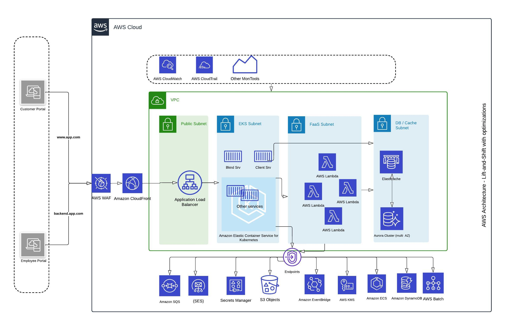

# AWS Migration with Optimization. 
**Solution:** Customer Profile Management 
## Introduction
Welcome to the AWS Migration with Optimization project! This documentation serves as a comprehensive guide to the migration process, detailing best practices and strategies for leveraging Amazon Web Services (AWS) to enhance efficiency and performance.

## Project Overview
This initiative focuses on seamlessly transitioning applications, data, and infrastructure to the AWS cloud environment. Through careful planning and execution, our goal is not only migration but also optimization — ensuring that the AWS resources are utilized to their full potential, leading to improved scalability, cost-effectiveness, and overall system performance.

## Current System Overview
- Customer Profile Management including the key features: Create, Update, Archive Customer profiles.
- Approval Workflow
- Digital Signature Processing
- **Eco-Friendly Image Capture and Analysis**
  - Via a truck driver app interface
  - Images are linked with location and customer ID
- **Existing technologies:** Stacks includes PHP frameworks and MySQL, ASP. Net, Jobs running on Python, with infrastructure supported by a Classic Load Balancer (LB) that directs traffic to a list of servers. Today, we'll discuss a strategic plan for enhancing this setup to meet our evolving needs.

## AWS Migration Strategy phases 
The company was approaching a critical renewal date in three months. To ensure a smooth transition, I've devised a three-phase migration strategy by exploring various migration strategies tailored to specific applications, including rehosting, refactoring, and rearchitecting.
- Phase 1: Lift and Shift with MVP (Minimum Viable Product)
   - Migrate essential components to the cloud.
   - Focus on cloud compliance for the Database, Cache, and File System.
   - Initial steps towards a cloud-native infrastructure.

- Phase 2: Improvement by replatforming existing servers/platforms by AWS PaaS
   - Embrace a microservices architecture.
   - Leverage Function-as-a-Service (FaaS) along with AWS Batch, ECS, and ECR.
   - Light implementation of the frontend, enabling scalability and flexibility.

- Phase 3: Microservices and Serverless Approach
    - Harness the power of Kubernetes to further decompose and manage frontend components.
    - Achieve fine-grained control and scalability by splitting the frontend into smaller, deployable units.

By adopting this three-phase strategy, I was well-prepared and able to meet the challenges of the impending renewal date and ensure a successful migration to the cloud.

## Your organization could be encountering comparable challenges. Let's engage in a discussion.  <a href="https://awsazureconsult.com">Visit my profile</a> or reach out via email at pierremathieu@awsazureconsult.com for further insights and information.
