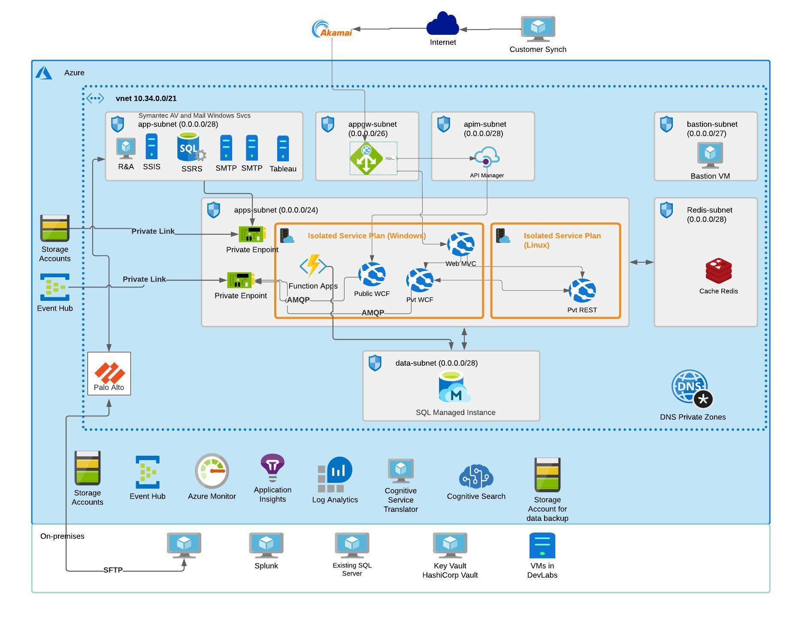

# Azure Migration and Optimization Project: A Comprehensive Overview

## Introduction
This document provides a detailed overview of a successful Azure migration and optimization project that I led, showcasing improvements achieved through the strategic implementation of Azure services. The project aimed to enhance performance, scalability, and overall efficiency by leveraging a combination of Azure services, including Redis, Azure Functions, AKS (Azure Kubernetes Service), Application Gateway, API Manager, Virtual Machines (VMs), SQL Managed Instances (SQL MI), and Azure Monitor. 

## Project Background
**Objective:**  
The primary objective of the project was to migrate and optimize existing workloads to Azure, ensuring a seamless transition while capitalizing on the advanced features of Azure services.

**Scope:**  
The scope included modernizing applications, improving data management, optimizing infrastructure, and enhancing overall system performance.

## Key Azure Services Implemented:
**1. Azure Redis Cache:**  
Implemented Azure Redis Cache to enhance data caching and retrieval, optimizing application performance by reducing latency and improving scalability.

**2. Azure Functions:**  
Leveraged serverless architecture with Azure Functions to enable event-driven, scalable, and cost-efficient execution of code, promoting agility and responsiveness in application development.

**3. Azure Kubernetes Service (AKS):**  
Utilized AKS for container orchestration, facilitating the deployment, scaling, and management of containerized applications with ease, streamlining the overall development and deployment process.

**4. Application Gateway:**  
Deployed Azure Application Gateway for efficient load balancing, SSL termination, and improved security, ensuring optimal performance and availability of applications.

**5. Azure API Manager:**  
Implemented Azure API Manager to centralize API management, ensuring security, scalability, and analytics for API consumption, thereby enhancing overall API governance.

**6. Virtual Machines (VMs):**  
Utilized Azure Virtual Machines to host specific workloads that required dedicated computing resources, ensuring flexibility and control over the underlying infrastructure.

**7. SQL Managed Instances (SQL MI):**  
Migrated on-premises databases to Azure SQL Managed Instances, benefiting from a fully managed relational database service with high availability and scalability.

**8. Azure Monitor:**  
Implemented Azure Monitor for comprehensive monitoring, diagnostics, and analytics, enabling proactive issue resolution, resource optimization, and enhanced overall system reliability.

## Achievements and Improvements:
**1. Enhanced Scalability:**  
The adoption of Azure Functions and AKS facilitated automatic scaling, allowing the system to seamlessly handle varying workloads with improved efficiency.

**2. Improved Application Performance:**  
Azure Redis Cache significantly reduced data retrieval times, enhancing overall application responsiveness and user experience.

**3. Cost Optimization:**  
Leveraging serverless computing with Azure Functions and optimizing VM usage contributed to substantial cost savings, aligning resource consumption with actual demand.

**4. Centralized API Management:**  
The implementation of Azure API Manager streamlined API management, enhancing security, discoverability, and governance for all APIs.

**5. Optimized Database Management:**  
Migration to Azure SQL Managed Instances resulted in improved database performance, high availability, and reduced administrative overhead.

**6. Comprehensive Monitoring and Analytics:**  
Azure Monitor provided real-time insights into application and infrastructure performance, enabling proactive issue resolution and continuous optimization.

**7. Increased System Reliability:**  
The combination of Application Gateway, Azure Functions, and AKS contributed to increased system reliability, ensuring consistent and resilient service delivery.

## onclusion
The successful execution of this Azure migration and optimization project not only achieved seamless cloud adoption but also brought about significant improvements in scalability, performance, and cost-effectiveness. By strategically leveraging Azure services such as Redis, Azure Functions, AKS, Application Gateway, API Manager, VMs, SQL MI, and Azure Monitor, the project stands as a testament to the transformative impact of embracing cloud-native solutions on overall IT infrastructure and application landscapes.

  
# Let's talk
## Your organization could be encountering comparable challenges. Let's engage in a discussion.  <a href="https://awsazureconsult.com">Visit my profile</a> or reach out via email at pierremathieu@awsazureconsult.com for further insights and information.
