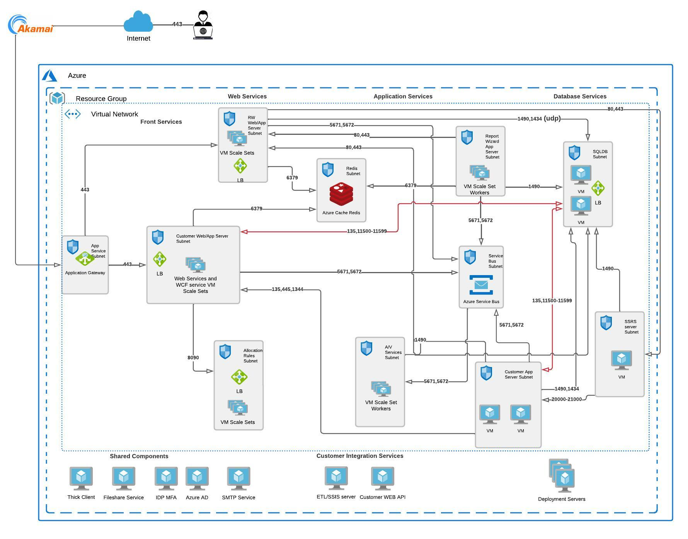

# Azure VM Rehosting for FinTech: Client Case Study of a client leveraging Azure. 

## Introduction
Welcome to the comprehensive documentation detailing the successful Azure VM rehosting project executed for our esteemed client in the financial technology (FinTech) sector. In this case study, we delve into the intricacies of migrating and rehosting virtual machines (VMs) to Microsoft Azure, outlining the strategic approach, challenges overcome, and the resultant benefits realized.

## Project Overview
As organizations increasingly embrace cloud solutions, our Microsoft client in the FinTech industry sought a seamless migration strategy for their VMs to Azure. The goal was to leverage the scalability, security, and performance benefits offered by Microsoft's cloud platform while ensuring minimal disruption to their critical financial operations.

## Key Objectives
- Seamless Migration: Execute a smooth and efficient transition of existing virtualized workloads to Azure, minimizing downtime and ensuring business continuity.
- Performance Optimization: Leverage Azure's advanced capabilities to enhance the performance of financial applications and services, meeting the stringent requirements of the FinTech sector.
- Security Compliance: Implement robust security measures to align with industry regulations and safeguard sensitive financial data throughout the migration process.
- Cost Efficiency: Optimize resource utilization and streamline operational costs by leveraging Azure's flexible pricing models and scalability features.

## Methodology
My approach to this Azure VM rehosting project involved meticulous planning, precise execution, and continuous collaboration with key stakeholders. From assessing the existing infrastructure to implementing best practices for Azure adoption, every step was carefully orchestrated to achieve a successful migration outcome.

  
## Let's talk
## Your organization could be encountering comparable challenges. Let's engage in a discussion.  <a href="https://awsazureconsult.com">Visit my profile</a> or reach out via email at pierremathieu@awsazureconsult.com for further insights and information.
