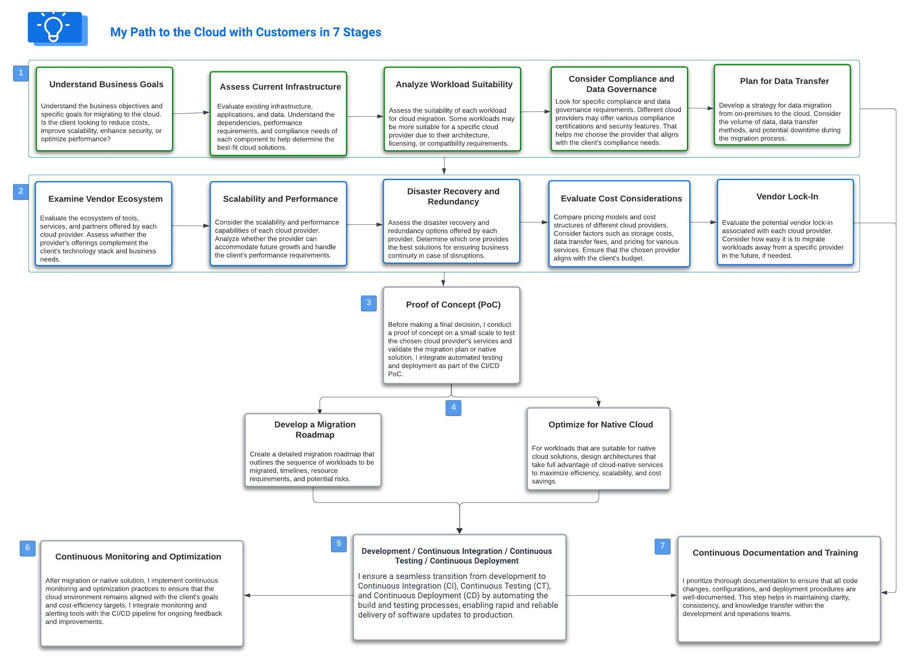

# Leveraging Cloud Best Practices: A Comprehensive Guide to Successful Cloud Projects

## Introduction
Embarking on cloud projects requires a strategic approach to ensure optimal outcomes aligned with business goals. This document highlights my experience leveraging key steps throughout various cloud projects with customers. Each step is meticulously executed to provide tangible benefits and results.

## 1. Understand Business Goals
Understanding the unique objectives of each customer is foundational. By aligning cloud solutions with business goals, we ensure that the technology serves as an enabler for achieving organizational success.

**Benefits:**
 - Strategic alignment.
 - Improved ROI.
 - Enhanced business agility.
## 2. Assess Current Infrastructure
A thorough examination of existing infrastructure allows for a clear understanding of the starting point. Identifying strengths and weaknesses forms the basis for effective planning.

**Benefits:**
 - Informed decision-making.
 - Reduced migration risks.
 - Efficient resource allocation.

## 3. Analyze Workload Suitability
Determining which workloads are best suited for the cloud is crucial. This analysis guides the migration strategy, ensuring a seamless transition of applications and services.

**Benefits:**

- Optimal workload performance.
- Cost-effective resource utilization.
- Enhanced scalability.
## 4. Consider Compliance and Data Governance
Adhering to regulatory compliance and data governance standards is non-negotiable. This step ensures that data is handled securely and in accordance with legal requirements.

**Benefits:**

- Mitigated legal risks.
- Improved data security.
- Enhanced customer trust.
## 5. Plan for Data Transfer
Developing a robust plan for data transfer minimizes downtime and ensures the secure migration of data to the cloud environment.

**Benefits:**

- Reduced downtime.
- Data integrity assurance.
- Smooth migration process.
## 6. Examine Vendor Ecosystem
Evaluating the cloud vendor's ecosystem ensures compatibility with existing tools and services, promoting a seamless integration experience.

**Benefits:**

- Interoperability.
- Streamlined operations.
- Enhanced efficiency.
## 7. Scalability and Performance
Designing for scalability and optimal performance guarantees that the cloud infrastructure can adapt to changing demands and deliver consistent, high-quality services.

**Benefits:**:

- Responsive applications.
- Efficient resource utilization.
- Cost savings during periods of low demand.
## 8. Disaster Recovery and Redundancy
Implementing robust disaster recovery and redundancy measures safeguards against data loss and minimizes service disruptions.

**Benefits:**

- Business continuity.
- Reduced downtime.
- Enhanced reliability.
## 9. Evaluate Cost Considerations
A meticulous evaluation of costs ensures budget adherence and maximizes the cost-effectiveness of cloud resources.

**Benefits:**

- Cost optimization.
- Improved financial predictability.
- Enhanced resource allocation efficiency.
## 10. Vendor Lock-In
Mitigating the risks associated with vendor lock-in allows for flexibility and freedom of choice in the long term.

**Benefits:**

- Enhanced flexibility.
- Mitigated dependency risks.
- Cost-effective transition options.
## 11. Proof of Concept (PoC)
Executing a proof of concept validates the viability of the chosen cloud solutions, offering a low-risk testing ground before full-scale implementation.

**Benefits:**

- Risk mitigation.
- Informed decision-making.
- Enhanced solution validation.
## 12. Develop a Migration Roadmap
A detailed migration roadmap provides a structured plan for implementation, minimizing disruptions and ensuring a smooth transition.

Benefits:

- Strategic alignment.
- Reduced implementation risks.
- Enhanced project management.
## 13. Optimize for Native Cloud
Optimizing applications for native cloud services ensures maximum performance and takes full advantage of cloud capabilities.

**Benefits:**

- Improved application performance.
- Enhanced scalability.
- Cost-efficient resource utilization.
## 14. Continuous Monitoring and Optimization
Implementing continuous monitoring and optimization practices ensures ongoing efficiency, cost-effectiveness, and responsiveness.

**Benefits:**

- Proactive issue resolution.
- Cost savings.
- Enhanced performance.
## 15. Development / Continuous Integration / Continuous Testing / Continuous Deployment
Adopting a continuous development and deployment approach promotes agility and ensures that changes are implemented seamlessly.

**Benefits:**

- Faster time to market.
- Improved collaboration.
- Reduced manual errors.
## 16. Continuous Documentation and Training
Maintaining up-to-date documentation and providing continuous training ensures that teams remain well-equipped to manage and optimize cloud resources effectively.

**Benefits:**

## Knowledge retention.
- Enhanced team proficiency.
- Smooth adaptation to evolving cloud environments.
## Conclusion
Leveraging these steps throughout cloud projects has consistently delivered successful outcomes, aligning technology with business objectives, ensuring security and compliance, optimizing costs, and fostering a culture of continuous improvement. This approach positions organizations to thrive in the dynamic landscape of cloud computing.

  
# Let's talk
## Your organization could be encountering comparable challenges. Let's engage in a discussion.  <a href="https://awsazureconsult.com">Visit my profile</a> or reach out via email at pierremathieu@awsazureconsult.com for further insights and information.
