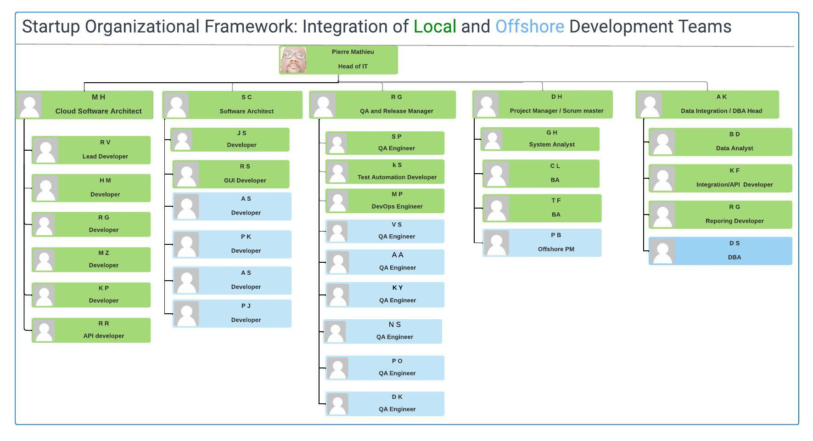
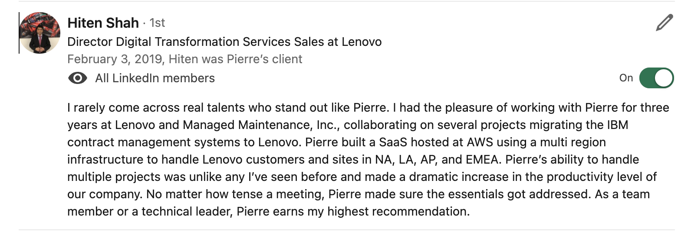

# Scaling and Transforming a Startup: A Leadership Journey

## Overview
This document outlines my leadership journey and the strategic processes employed to grow and transform a startup focused on IT asset and contract management. As the head of the development, I navigated the challenges of a critical project with Lenovo, scaling the development team, enhancing infrastructure, and achieving financial growth.

## I. Introduction
Our startup began with a modest team of three developers, including myself, and one QA professional. The pivotal task at hand was spearheading a crucial deal with Lenovo.

## II. The 4 Principles that guide my leadership approach
- **A. Prioritizing Customer Needs**  
I prioritized the Lenovo deal as a customer-centric opportunity, recognizing its significance for our startup's growth. My leadership ensured that our solutions aligned with Lenovo's requirements, thereby fostering a strong customer relationship.

- **B. Taking Ownership**  
Taking ownership, I expanded the development team rapidly, bringing in diverse talents, including DBAs, QA engineers, developers, project managers, and BAs, to ensure the successful execution of the Lenovo project.

- **C. Fostering Innovation**  
Embracing the AWS cloud, I led the migration of our SaaS solution to leverage the pillars of security, reliability, performance, and availability. This transformative step aimed to simplify operations and enhance the overall efficiency of our offerings.

- **D. Embracing Continuous Learning**  
Facing the challenges of scaling the team and migrating to the cloud, I fostered a culture of continuous learning. Embracing microservices as a foundational element became imperative, promoting innovation and adaptability within the company.

## III. Development Team Growth
**A. Rapid Expansion**  
Building a team of over 30 members in a short period required strategic planning. I orchestrated the recruitment process, ensuring a balance between onshore and offshore talents to harness a global perspective.

**B. Skill Diversity**  
Recruiting diverse roles, including technical and non-technical positions, facilitated a collaborative and well-rounded team. This approach contributed to an innovative work environment and a more comprehensive understanding of project requirements.

## IV. Infrastructure Enhancement
**A. Cloud Migration Strategy**  
The decision to migrate to the AWS cloud was driven by the need for scalability and improved infrastructure reliability. This move also aligned with the startup's financial objectives by optimizing costs through cloud services.

**B. Microservices Adoption**  
Recognizing microservices as a critical component, I championed their integration into our development approach. This architectural shift enabled the team to work on independent components, fostering agility and minimizing development bottlenecks.

## V. Financial Growth
**A. Strategic Partnerships**  
The successful completion of the Lenovo project, coupled with the enhanced capabilities of our development team and infrastructure, positioned our startup for strategic partnerships. This, in turn, contributed significantly to our financial growth.

**B. Cost Optimization**  
The AWS cloud migration not only improved performance but also optimized costs through efficient resource utilization. This financial prudence played a pivotal role in sustaining the startup during its growth phase.

## VI. Conclusion
Navigating the growth of a startup demands strategic leadership aligned with core principles. By prioritizing customer needs, taking ownership, fostering innovation, and embracing transformative shifts, I successfully led the development team through a critical Lenovo deal, expanded its capabilities, enhanced infrastructure, and fueled financial growth. This journey underscores the importance of combining technical acumen with leadership principles to drive success in the dynamic landscape of startup development.

## Your organization could be encountering comparable challenges. Let's engage in a discussion.  <a href="https://awsazureconsult.com">Visit my profile</a> or reach out via email at pierremathieu@awsazureconsult.com for further insights and information.
