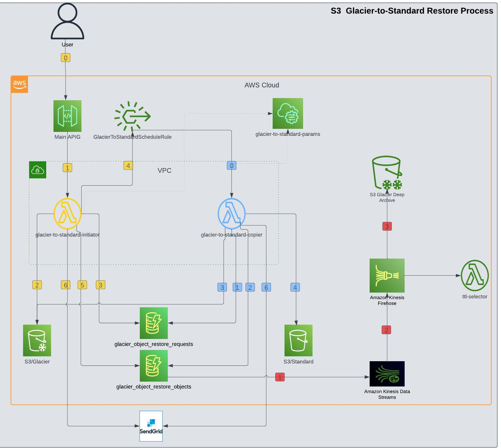

# S3 Glacier to Standard Transfer
# Introduction
The transition from Amazon S3 Glacier to Standard storage class for log analysis is driven by the need for more immediate access and faster retrieval times of log data. S3 Glacier is designed for long-term archival with a trade-off of lower cost at the expense of longer retrieval times. However, log analysis often requires quick access to historical data for real-time insights, troubleshooting, or compliance purposes.

# Project Overview
- The task at hand aims to develop a serverless Python-based solution that facilitates the transfer of data from S3 Glacier to the Standard storage class. This process allows for the specification of a datetime range based on the last modified time of the objects that need to be restored from Glacier. To accomplish this, the solution requires several components and leverages various AWS services.

- The following AWS services are utilized:

  - S3: The S3 service is used to store the objects and contains the bucket from which the objects are to be restored.

  - API Gateway: API Gateway resources are employed, specifically the `/glacier-to-standard` endpoint, which acts as a trigger for initiating the restoration process.

  - Lambda Functions: Two lambda functions are utilized in the solution:

    - a. `glacier-to-standard-initiator`: This function is responsible for initiating the restoration process. It takes parameters such as the S3 bucket name, a prefix to narrow down the search for objects, the retention period in days, and the email address of the requester, as below:
        -  `bucket_name`: Name of the bucket.
        -  `start_date` and `end_date`: Start and end datetimes for filtering objects based on the last modified time.
        -  `bucket_prefix`: A prefix to narrow down the search for specific objects.
        -  `retention_days`: The number of days to retain the restored objects.
        -  `request_owner`: The email address of the requester.

    - b. `glacier-to-standard-copier`: This function is responsible for copying the restored objects from Glacier to the Standard storage class. It retrieves the necessary information from the SQS queue.

  - Eventbridge Rule: An Eventbridge Rule named `GlacierToStandardScheduleRule` is employed to schedule a cron job that triggers the restoration process after a specified time. This ensures the process is automated.

  - Secrets Manager: Secrets Manager is utilized to store the secrets such as SendGrid API key.

  - DynamoDB: Two DynamoDB tables are utilized in the solution:

    - a. `glacier_object_restore_requests`: This table stores information about the restore requests, including the request status. It gets filled by the `glacier-to-standard-copier` function and updated by the `glacier-to-standard-copier` function.

    - b. `glacier_object_restore_objects`: The table holds data regarding S3 objects. It gets filled by the `glacier-to-standard-copier` function and updated by the `glacier-to-standard-copier` function.

By leveraging these AWS services and implementing the two lambda functions, the solution facilitates the seamless transfer of data from S3 Glacier to the Standard storage class based on the specified datetime range.

## Architecture
 
## The process involving the two lambda functions, "glacier-to-standard-initiator" and "glacier-to-standard-copier," can be described in full detail as follows:

### 1. Lambda 1 - glacier-to-standard-initiator:
- Step 0: An external action triggers the API Gateway (APIG) to execute the "/glacier-to-standard" endpoint using the POST method. The API payload contains the following information:

    {

      "bucket_name": "logs-418321941424",

      "bucket_prefix": "ServiceChangeRequestAccessLogs2020",

      "start_date": "2020-07-24 06:00:00",

      "end_date": "2020-07-24 07:00:00",

      "retention_days": "1",

      "requester_email": "pierremathieu@awsazureconsult.com
    }

##
- Step 1: The API Gateway invokes the lambda function `glacier-to-standard-initiator`.

- Step 2: `glacier-to-standard-initiator` reads the objects from the specified bucket name based on the given criteria to initiate the restore process for the objects.

- Step 3: `glacier-to-standard-initiator` populates the `glacier_object_restore_objects` DynamoDB table with essential details about the S3 files, including their Object Keys and statuses.

- Step 4: `glacier-to-standard-initiator` inserts the necessary information about the restore request, along with its status, into the DynamoDB table `glacier_object_restore_requests`.

- Step 5: `glacier-to-standard-initiator` enables the event bridge rule `GlacierToStandardScheduleRule`. This ensures that the process will be triggered automatically after the specified time.

- Step 6: `glacier-to-standard-initiator` notifies the requester about the process initiation by sending an email through SendGrid.rid.

### 2. Lambda 2 - glacier-to-standard-copier:
- Step 0: The hourly cron job associated with `GlacierToStandardScheduleRule` invokes the lambda function `glacier-to-standard-copier`. The process will proceed with the `Step 1` once the files are restored from the glacier and become ready to be copied to the standard bucket.

- Step 1: The lambda function `glacier-to-standard-copier` retrieves essential information from the `glacier_object_restore_requests` table in a first-in-first-out (FIFO) manner. It obtains the payload of the oldest pending request, which serves as the criteria for copying the restored glacier objects.

- Step 2: Before attempting to copy the objects to the standard storage, `glacier-to-standard-copier` queries the Object keys from the `glacier_object_restore_objects` table and verifies their restore status.

- Step 3: `glacier-to-standard-copier` copies the restored objects into the standard bucket.

- Step 4: `glacier-to-standard-copier` updates the DynamoDB table `glacier_object_restore_objects` with information about the copied objects.

- Step 5: `glacier-to-standard-copier` updates the DynamoDB table `glacier_object_restore_requests` to reflect the progress and completion of the restore process.

- Step 6: Using SendGrid, `glacier-to-standard-copier` sends an email to the requester to notify them of the completion of the process.

  
# Let's talk
## Your organization could be encountering comparable challenges. Let's engage in a discussion.  <a href="https://awsazureconsult.com">Visit my profile</a> or reach out via email at pierremathieu@awsazureconsult.com for further insights and information.
