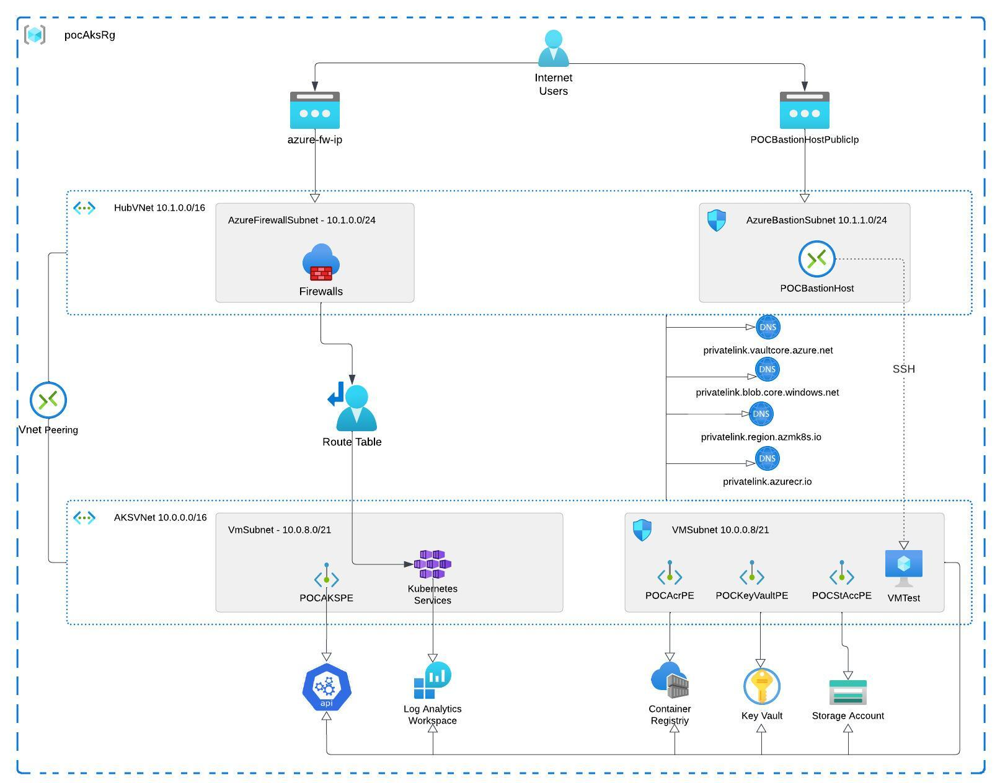

 ## The deployment of a private Azure Kubernetes Services (AKS) cluster, inclusive of essential components like a storage account, virtual network peering, and private endpoints. The implementation was orchestrated through a meticulously structured Terraform script featuring various modules designed for integration into the main.tf file. These modules encapsulated key elements crucial for the Azure environment, showcasing a methodical and well-coordinated approach to infrastructure deployment.
 

 
### The modules included:
- **aks:** Configured Azure Kubernetes Service to provide a scalable and managed Kubernetes environment.
- **bastion_host:** Implemented a bastion host for secure access to the Azure infrastructure.
- **container_registry:** Set up a container registry for efficient management and deployment of containerized applications.
- **firewall:** Implemented a firewall to control and monitor network traffic.
- **key_vault:** Established a key vault for secure storage and management of sensitive information.
- **log_analytics:** Integrated log analytics for comprehensive monitoring and analysis of system logs.
- **private_dns_zone:** Configured a private DNS zone for enhanced name resolution within the Azure environment.
- **private_endpoint:** Implemented private endpoints to securely access Azure services over a private connection.
- **route_table:** Managed route tables for efficient routing of network traffic.
- **storage_account:** Configured storage accounts for reliable and scalable data storage.
- **virtual_machine:** Set up virtual machines to support various components of the infrastructure.
- **virtual_network:** Established virtual networks to isolate and organize resources effectively.
- **virtual_network_peering:** Enabled peering between virtual networks for seamless communication.
